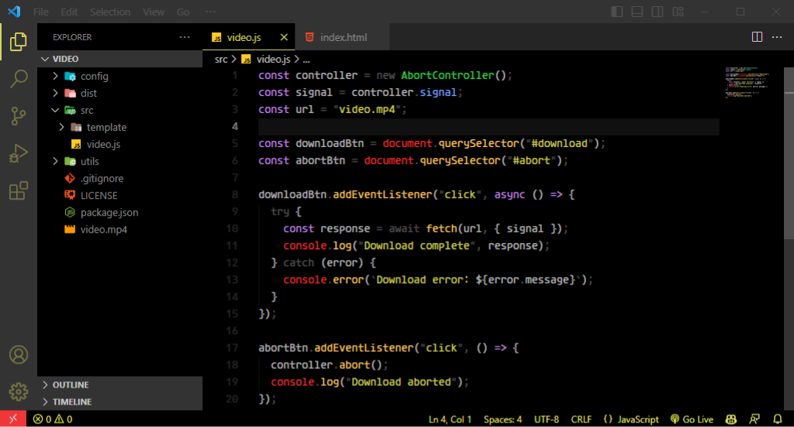

<div align="center">

# Snow Crash Dark Theme

A dark theme for [Visual Studio Code](https://code.visualstudio.com/) inspired by sci-fi novels.



</div>

## Installation

1. Open the **Extensions** sidebar in VS Code. `View > Extensions`
1. Search for `Snow Crash`, choose "Snow Crash Theme" by **Geovanny Reyes**
1. Click **Install** to install it
1. Navigate to `File > Preferences > Color Theme > Snow Crash`

## Recommended font

Snow Crash looks best with **Agave Nerd Font** from [Nerd Fonts](https://www.nerdfonts.com/).

1. Download [Agave.zip](https://github.com/ryanoasis/nerd-fonts/releases/latest/download/Agave.zip) (also listed on the [Nerd Fonts downloads page](https://www.nerdfonts.com/font-downloads))
1. Unzip it and install the `.ttf` files (on Windows: right click > **Install for all users**)
1. Open `settings.json` (`Ctrl+Shift+P` > **Preferences: Open User Settings (JSON)**) and add:

```json
"editor.fontFamily": "'Agave Nerd Font', monospace",
"terminal.integrated.fontFamily": "'Agave Nerd Font'"
```

1. Restart VS Code

## Contributing

Please report any issues [here](https://github.com/threevanny/snow-crash-dark-theme/issues).

## License

This theme is released under the [GNU General Public License v2.0](https://github.com/threevanny/snow-crash-dark-theme/blob/main/LICENSE).

## Author

Designed by **[Geovanny Reyes](https://www.threevanny.com)**
